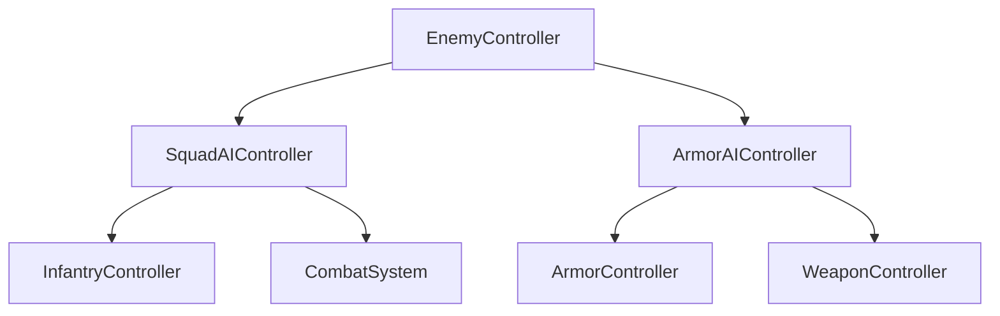

# Architecture Pattern Analysis — Full Gameplay Codebase

A deep analysis of `Assets/NewFolder/Scripts/` to name every pattern — obvious and non-obvious — that shapes your architecture and its affordances.

---

## 1. The Patterns You're Using

### Pattern 1: Entity = Config + Model + Controller + View (+State, +Visuals)

Every gameplay entity follows a consistent vertical slice:

| Role | Responsibility | Example |
|------|---------------|---------|
| **Config** | Immutable `ScriptableObject` — designer-facing data | `ArmorConfig`, `WeaponConfig` |
| **Model** | Mutable runtime state. Immutables via constructor, mutables via properties | `ArmorModel`, `PlatformModel` |
| **Controller** | Owns a `Dictionary<int, Model>` registry. Orchestrates logic | `ArmorController`, `WeaponController` |
| **View** | Owns a `Dictionary<int, Visuals>` registry. Manages GameObjects | `ArmorView`, `PlatformView` |
| **State** | Read-only snapshot struct, returned by `ReadXxxState()` | `ArmorState`, `PlatformState` |
| **Visuals** | MonoBehaviour on the prefab, exposes visual API | `ArmorVisuals`, `WeaponVisuals` |

> [!TIP]
> **What works**: This is consistent and predictable. Finding any entity's logic is trivial. Adding a new entity type means copying the pattern.

> [!WARNING]
> **What's implicit**: This pattern isn't documented or enforced. It's a convention in your head. If someone joins the project, they'd have to infer it from examples.

---

### Pattern 2: Registry Controller (Entity Manager)

Every Controller manages multiple instances via `Dictionary<int, Model>` + `int idCounter`:

```csharp
private int idCounter;
private readonly Dictionary<int, XxxModel> registry = new();

public int SpawnXxx(...) {
    var nextId = ++idCounter;
    var model = new XxxModel(nextId, ...);
    registry[nextId] = model;
    ...
    return nextId;
}
```

Used in: `ArmorController`, `PlatformController`, `InfantryController`, `WeaponController`, `ProjectileController`, `RocketController`, `RamEffect`, `RewardController`, `ProductionBuildingController`, `SquadAIController`.

**Exception**: `TruckController` holds a single `TruckModel model` (not a registry) because there's only one truck. This is a quiet rule violation — it's structurally different from every other controller but lives in the same `Units/` folder.

> [!NOTE]
> This is essentially a hand-rolled **Entity-Component-System without the System reuse** — each Controller is both the "system" and the "entity manager" for one type.

---

### Pattern 3: Composition Root (Manual DI)

[GameBootstrapper.cs](file:///Users/nazarpinonzik/Documents/GitHub/TractorVsZombie/Assets/NewFolder/Scripts/GameBootstrapper.cs) is a single `MonoBehaviour` that constructs **everything** in `Build()` and calls `Update()` on everything in order.

```csharp
private void Build() {
    var vehicleService = new VehicleService(...);
    ...
    armorController = new ArmorController(combatSystem, weaponController, ...);
    ...
}

private void Update() {
    combatSystem.Update();
    ramEffect.Update();
    ...
    playerController.Update();
}
```

> [!TIP]
> **What works**: Zero framework magic. Dependencies are visible. Update order is explicit and easy to reason about.

> [!WARNING]
> **What's implicit**: The update order encodes a **data-flow contract**. `CombatSystem.Update()` must run before `ArmorController.Update()` because armor reads combat output. But nothing enforces or documents this. Reordering lines could introduce subtle bugs.

---

### Pattern 4: State Struct as Cross-Controller Communication

Controllers communicate via read-only snapshot structs:

```csharp
// ArmorController exposes:
public ArmorState ReadArmorState(int armorId) { ... }

// ArmorAIController consumes:
var state = armorController.ReadArmorState(armorId);
weaponController.AimWeapon(state.weaponId, ...);
```

State structs carry **IDs from other systems** (e.g. `ArmorState.combatId`, `ArmorState.weaponId`), letting the consumer call those systems directly.

> [!IMPORTANT]
> **The implicit pattern**: State structs are **ID bridges**. They don't contain behavior — they expose the *handles* needed to operate on an entity through other controllers. This is effectively a **capability token** pattern.

---

### Pattern 5: Pull-Based Combat Output

Combat damage isn't pushed via events/callbacks. Instead, `CombatSystem` accumulates damage during its `Update()`, then each controller **pulls** the result:

```csharp
// In ArmorController.ReadCombatOutput():
var combatOutput = combatSystem.GetCombatOutput(model.CombatId);
if (combatOutput.damageWasFatal) { ... }

// In InfantryController.ReadCombatState():
var combatOutput = combatSystem.GetCombatOutput(model.CombatId);
if (combatOutput.damageWasFatal) { ... }
```

This pattern repeats in `ArmorController`, `InfantryController`, `ProductionBuildingController` — all with identical polling logic.

> [!NOTE]
> This is a **frame-synchronized polling** pattern (vs. event-driven). It works because `GameBootstrapper` guarantees `combatSystem.Update()` runs first. The downside is duplicated polling boilerplate across every entity that takes damage.

---

### Pattern 6: Controller Hierarchy (AI Layer wraps Entity Layer)

AI controllers don't own entity data — they hold **lists of entity IDs** and call the entity controller's public API:



- `SquadAIController` holds `List<int> SubordinateIds` → calls `infantryController.Move()`, `.Attack()`
- `ArmorAIController` holds `List<int> controlledArmorIds` → calls `armorController.Drive()`, `.Brake()`, `.SteerToward()`

> [!TIP]
> This is a clean **orchestrator pattern**: AI doesn't duplicate entity logic, it drives it through the entity's existing public API.

> [!WARNING]
> **Validation is manual**: `ArmorAIController.ValidateArmorIds()` calls `armorController.WriteDeadArmorFiltered(controlledArmorIds)` — a mutable pass-by-reference filter. `SquadAIController.ValidateSubordinates()` does its own loop with `infantryController.IsExist()`. Two different validation patterns for the same concept.

---

### Pattern 7: Services vs. Controllers (Implicit Layering)

Your codebase has two kinds of "systems" without an explicit naming convention:

| Type | Naming | Own entities? | Examples |
|------|--------|--------------|---------|
| **Service** | `XxxService` | Yes (registry) | `VehicleService`, `PhysicsService`, `PathfindingService`, `LocalAvoidanceService` |
| **Controller** | `XxxController` | Yes (registry) | `ArmorController`, `WeaponController` |
| **System** | `XxxSystem` | Yes (registry) | `CombatSystem` |
| **Effect** | `XxxEffect` | Yes (registry) | `RamEffect` |

All four are structurally identical (constructor DI, registry, `Update()`), but the naming implies different abstraction levels:
- **Services** live in `Engine/` → lower-level, reusable infrastructure
- **Controllers** live in feature folders → feature-specific logic
- **CombatSystem** is in `Combat/` → neither service nor controller naming
- **RamEffect** is in `Effects/` → yet another naming convention

> [!IMPORTANT]
> The implied hierarchy is: **Services ← Controllers ← AI Controllers ← Enemy/Player orchestrators**. But nothing prevents a Service from depending on a Controller or vice versa. The layering is informal.

---

### Pattern 8: Mechanics as Pure Static Functions

`Mechanics/` contains stateless utility classes:

```csharp
public static class VehicleDriving {
    public static float GasThrottle(float gasInput, bool boostInput, float maxTorque) { ... }
    public static float SteerToward(Vector3 direction, Vector3 velocity, float maxSteer) { ... }
}
```

Also: `AimStrategy`, `CohesionFormation`. These are **domain algorithms** extracted from controllers — pure functions with no state.

> [!TIP]
> This is an excellent pattern. It makes the algorithms testable, reusable, and independent of entity lifecycle.

> [!NOTE]
> However, `CohesionFormation` is stateful (has `Clear()`, `AddMember()`, `Compute()`) — it's actually a stateful calculator, not a pure function. It lives in `Mechanics/` alongside the pure functions, blurring the category.

---

### Pattern 9: View as a Thin Shell Over GameObjects

Views are plain C# classes (not MonoBehaviours) that `Instantiate` and `Destroy` GameObjects:

```csharp
public class PlatformView {
    private readonly Dictionary<int, PlatformVisuals> visualsRegistry = new();
    
    public void AddPlatform(int id, Vector3 position, PlatformVisuals prefab) {
        var visuals = GameObject.Instantiate(prefab, position, Quaternion.identity);
        visualsRegistry[id] = visuals;
    }
}
```

The pattern is consistent: View manages a parallel `Dictionary<int, Visuals>` mirroring the Controller's `Dictionary<int, Model>`.

> [!NOTE]
> The Controller and View registries use the **same IDs** but are **separate dictionaries** not connected by any abstraction. If a Controller deletes a model but forgets to call `view.Remove()`, the visual leaks silently. The invariant "Controller and View registries are in sync" is maintained purely by discipline.

---

### Pattern 10: Production Building as Polymorphic Factory

`ProductionBuildingController` spawns **different entity types** based on `SpawnType`:

```csharp
if (model.Config.spawnType == SpawnType.Infantry)
    infantryController.SpawnInfantry(...);
else if (model.Config.spawnType == SpawnType.Armor)
    armorController.SpawnArmor(...);
```

This means `ProductionBuildingController` directly depends on both `InfantryController` and `ArmorController`. Every new spawn type requires modifying this controller and adding a new dependency.

> [!WARNING]
> This is a textbook **Open/Closed Principle violation** — the factory isn't extensible without modification. It's also why `ProductionBuildingController` has the **largest constructor** in the codebase (8 dependencies).

---

### Pattern 11: Config as Polymorphic Data Bag

Several configs carry data for **multiple variants** using flags/enums:

```csharp
public class WeaponConfig : ScriptableObject {
    public BallisticConfig ballisticConfig; // contains BOTH bullet and rocket configs
}

public struct BallisticConfig {
    public BallisticType type;     // discriminator
    public ProjectileConfig bullet; // only valid if type == Bullet
    public RocketConfig rocket;    // only valid if type == Rocket
}
```

This is the same "flat tagged union" anti-pattern found in the old `RewardModel` — one of the two variant configs is always meaningless but still present.

> [!NOTE]
> `ProductionBuildingConfig` similarly carries `infantryConfig` and `armorConfig` where only one is used based on `spawnType`.

---

### Pattern 12: Controller Reads External State, Writes External Input

Most controllers follow a consistent update loop shape:

```csharp
public void Update() {
    ReadExternalState();   // Pull state from services
    ProcessLogic();        // Internal logic
    WriteExternalInput();  // Push commands to services
    UpdateView();          // Sync visuals
}
```

Best example: [TruckController](file:///Users/nazarpinonzik/Documents/GitHub/TractorVsZombie/Assets/NewFolder/Scripts/Units/Truck/TruckController.cs) with `ReadExternalState()` → `WriteExternalInput()` → `UpdateView()`. `ArmorController` follows this too: `ReadCombatOutput()` → `RemoveDeadArmor()` → `SyncVehiclesPositions()` → `UpdateVehiclePhysics()` → `UpdateView()`.

> [!TIP]
> This is a clean **input→process→output** pipeline. It makes each controller's data flow predictable.

---

## 2. Architectural Tensions

### A. No concept of "shared data contracts"

As the LoadoutConfig case showed: when data needs to flow through multiple features, there's no convention for where shared types live. `WeaponConfig` is in `Weapon/`, `LoadoutConfig` is in `Loadout/` — both are shared contracts, but their placement was ad-hoc.

**Missing**: A `Shared/` or `Contracts/` convention, or at minimum a documented rule like *"if a config is referenced by 3+ features, it gets its own folder."*

### B. Two entity validation patterns

- `ArmorAIController` validates via `armorController.WriteDeadArmorFiltered(list)` — mutates the caller's list
- `SquadAIController` validates via `infantryController.IsExist(id)` — queries one at a time

Neither pattern is wrong, but using both creates inconsistency.

### C. The naming taxonomy is informal

`Service`, `Controller`, `System`, `Effect` all have the same shape (DI, registry, Update) but imply different abstraction levels. The mental model works but isn't codified:

```
Engine layer:    VehicleService, PhysicsService, PathfindingService, LocalAvoidanceService
Domain layer:    CombatSystem
Feature layer:   ArmorController, WeaponController, InfantryController, ...
Effect layer:    RamEffect
AI layer:        SquadAIController, ArmorAIController
Orchestration:   EnemyController, PlayerController
```

### D. Controller ↔ View sync is unprotected

Controllers and Views maintain parallel registries with no shared lifecycle management. The invariant relies entirely on every `Delete` method remembering to call both `registry.Remove()` and `view.Remove()`.

### E. `ProductionBuildingController` is a dependency magnet

With 8 constructor dependencies, it spans the most layers of any single class. It needs services (Vehicle, Physics, Pathfinding, Avoidance), the combat system, and two entity controllers (Infantry, Armor). This suggests it might benefit from an intermediate abstraction (e.g., a `SpawnService` or factory delegate pattern).

---

## 3. Summary Table

| # | Pattern | Status |
|---|---------|--------|
| 1 | Config/Model/Controller/View/State slice | ✅ Consistent, works well |
| 2 | Registry Controller (entity manager) | ✅ Consistent, minor exception in `TruckController` |
| 3 | Manual DI Composition Root | ✅ Explicit, no magic |
| 4 | State struct as ID bridge | ✅ Clean cross-controller communication |
| 5 | Pull-based combat output | ⚠️ Works, but duplicated polling boilerplate |
| 6 | AI orchestrator layer | ✅ Clean separation of concerns |
| 7 | Service/Controller naming taxonomy | ⚠️ Informal, 4 different suffixes for same shape |
| 8 | Pure static mechanics | ✅ Excellent testability |
| 9 | View as thin GameObject shell | ⚠️ Unprotected sync with Controller registry |
| 10 | Production building as polymorphic factory | ⚠️ OCP violation, dependency magnet |
| 11 | Config as flat tagged union | ⚠️ Meaningless variant fields |
| 12 | Read→Process→Write→View update loop | ✅ Predictable data flow |
| — | Shared data contracts convention | ❌ Missing |
| — | Entity validation pattern | ⚠️ Inconsistent (mutate-list vs. query-exists) |
