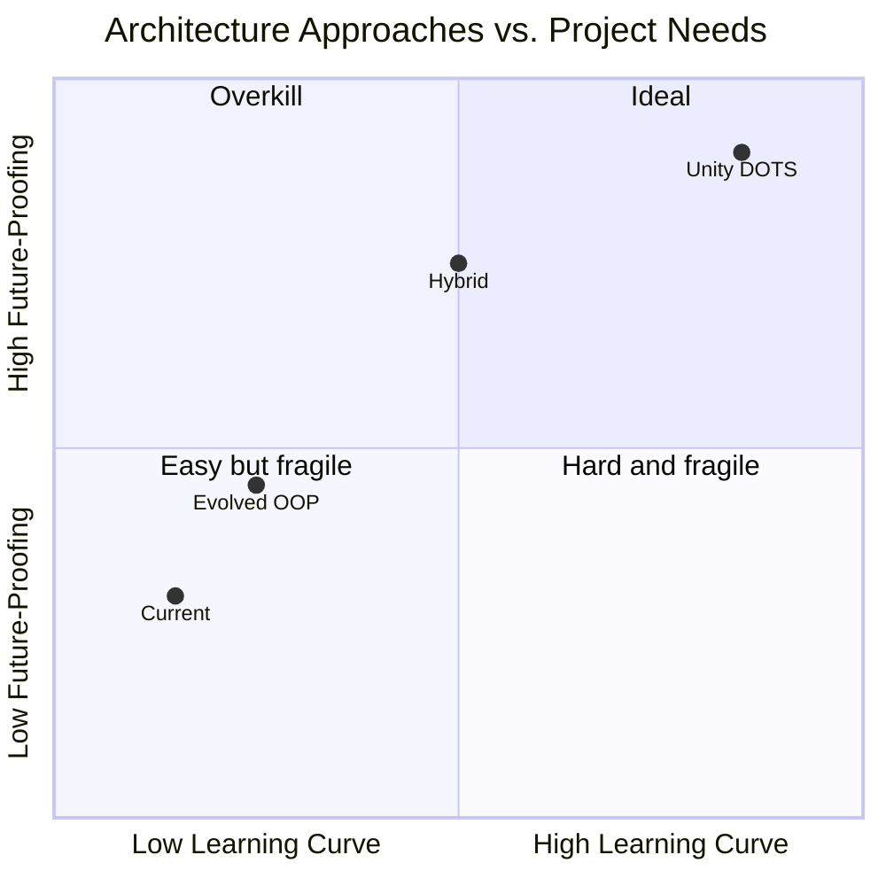

# From-Scratch Redesign — Architecture Proposal

A thought experiment: knowing what your codebase teaches us, what would I build from scratch, and why? This document traces problems to root causes, derives architectural principles from them, and proposes a concrete structure.

---

## Part 1: Root Cause Analysis

Every problem in the current codebase traces back to a small set of **missing structural constraints**. Understanding these is more valuable than any specific fix.

### Cause A: No Separation Between "What Exists" and "What Happens To It"

Your controllers are both **entity managers** (own the registry, handle spawn/delete lifecycle) and **behavior processors** (drive, shoot, take damage). This coupling is the source of:

| Problem | How Cause A produces it |
|---------|------------------------|
| `ProductionBuildingController` has 8 deps | It needs to *create* Infantry and Armor, so it depends on their controllers. If creation were separate from behavior, it would only depend on a spawn interface |
| AI controllers re-validate entity existence | `SquadAIController` must check if infantry is alive because infantry lifecycle is inside `InfantryController`, which the AI doesn't own |
| `TruckController` breaks the registry pattern | Only one truck exists, but it still needs the same controller shape because the controller *is* the entity manager |

**Principle**: Separate entity lifecycle (create/destroy) from entity behavior (update each frame).

---

### Cause B: No Type-Level Distinction Between Data Layers

Configs, Models, States, and Prefab references are all plain C# types with no structural distinction. A `RewardModel` can hold a `GameObject` prefab just as easily as a `Vector3`. Nothing in the type system signals "this shouldn't be here."

| Problem | How Cause B produces it |
|---------|------------------------|
| `RewardModel` carrying `GameObject` prefabs | No constraint prevents view-layer data from entering the model layer |
| `BallisticConfig` flat tagged union | No pattern enforces "variant data should be separate types" |
| Config/Model/View sync relies on discipline | Nothing structurally ties a Model ID to a View ID |

**Principle**: Make layer violations hard at the type level, not just by convention.

---

### Cause C: Horizontal Concepts Have No Home

The folder structure is feature-vertical (`Units/Armor/`, `Weapon/`, `Reward/`), but concepts like "loadout", "spawn result", "damage event" cut across features.

| Problem | How Cause C produces it |
|---------|------------------------|
| LoadoutConfig data scattered across 4 modules | No folder/namespace for shared concepts between features |
| Combat output polling duplicated 3 times | "React to damage" is a cross-cutting concern with no home |
| State structs carry mixed-domain IDs | `ArmorState` knows about `combatId`, `weaponId`, `vehiclePhysicsId` — crossing 3 domain boundaries in one struct |

**Principle**: Establish an explicit shared layer for cross-cutting data contracts.

---

### Cause D: Implicit Update Ordering

The `GameBootstrapper.Update()` method is a flat ordered list. The dependencies between systems (CombatSystem must update before ArmorController reads combat output) are invisible.

| Problem | How Cause D produces it |
|---------|------------------------|
| Reordering Update calls can cause subtle bugs | No declared dependency between systems |
| New systems require manual insertion at the right position | Developer must understand the full data flow to place a new system |

**Principle**: Make data dependencies between systems explicit, either through declared dependencies or phased execution.

---

## Part 2: Three Approaches Compared

### Approach 1: Evolved OOP (Fix What You Have)

Keep your Config/Model/Controller/View pattern but add **structural rules**:

```
Scripts/
├── Core/                          # Shared infrastructure
│   ├── EntityRegistry<TModel>     # Generic registry, replaces per-controller dict
│   ├── IEntityLifecycle            # Create/Destroy contract
│   └── IFrameProcessor            # Update contract with declared dependencies
├── Contracts/                     # Cross-cutting data
│   ├── LoadoutConfig.cs
│   ├── DamageEvent.cs
│   └── SpawnRequest.cs
├── Services/                      # Stateful infrastructure (unchanged)
├── Features/                      # Vertical slices
│   ├── Armor/
│   │   ├── ArmorConfig.cs
│   │   ├── ArmorModel.cs          # NO GameObject refs allowed
│   │   ├── ArmorBehavior.cs       # Only update logic, receives registry
│   │   └── ArmorView.cs
│   └── ...
└── Orchestration/                 # Top-level coordinators
    ├── PlayerOrchestrator.cs
    └── EnemyOrchestrator.cs
```

**Key changes**:
- `EntityRegistry<T>` genericizes the id + dictionary pattern
- `Contracts/` folder for shared types — the convention the codebase was missing
- Controllers split into `XxxSpawner` (lifecycle) and `XxxBehavior` (frame logic)
- `IFrameProcessor.DependsOn` declares update ordering

**Pros**: Minimal conceptual leap. Your team already knows the patterns.
**Cons**: Still manually wired. Still verbose. Doesn't solve data layout performance.

---

### Approach 2: Unity DOTS/ECS

Full data-oriented rewrite. Entities are just IDs. Components are pure data structs. Systems are stateless processors.

```
Scripts/
├── Components/
│   ├── Position.cs                # IComponentData { float3 Value; }
│   ├── Health.cs                  # IComponentData { int Current; int Max; }
│   ├── VehicleInput.cs            # IComponentData { float motor, brakes, steer; }
│   ├── WeaponState.cs
│   ├── LoadoutRef.cs              # References a LoadoutConfig blob asset
│   └── Tags/
│       ├── ArmorTag.cs            # Zero-size tag component
│       ├── InfantryTag.cs
│       └── DestroyedTag.cs
├── Systems/
│   ├── DamageResolutionSystem.cs  # Processes all Health components
│   ├── DeathRewardSystem.cs       # Queries (Health, Destroyed, LoadoutRef) → spawns reward
│   ├── VehicleDrivingSystem.cs    # Queries (VehicleInput, Position)
│   ├── WeaponFiringSystem.cs
│   ├── RewardPickupSystem.cs
│   └── CleanupSystem.cs           # Destroys entities with DestroyedTag
├── Authoring/                     # MonoBehaviour → Entity conversion
└── Config/                        # ScriptableObjects for designer data
```

**How this solves every root cause**:

| Root Cause | DOTS Solution |
|-----------|---------------|
| A: Lifecycle + behavior coupled | `CleanupSystem` handles all deletion. Each system only processes behavior |
| B: No layer separation | Components are pure data structs — can't hold GameObjects. Visuals are separate `ICleanupComponentData` |
| C: No horizontal concept home | Systems query by *component combination*, not entity type. `DeathRewardSystem` doesn't care if it's Armor or Infantry — it queries `(Health <= 0, LoadoutRef)` |
| D: Implicit update ordering | `[UpdateBefore(typeof(X))]` / `[UpdateAfter(typeof(Y))]` attributes declare dependencies. Unity resolves order automatically |

**Example — the LoadoutConfig problem wouldn't exist**:

```csharp
// Any entity with these components automatically participates in the reward system
public struct LoadoutRef : IComponentData {
    public BlobAssetReference<LoadoutBlob> Value;
}

[UpdateAfter(typeof(DamageResolutionSystem))]
public partial struct DeathRewardSystem : ISystem {
    public void OnUpdate(ref SystemState state) {
        foreach (var (health, loadout, pos) in 
            SystemAPI.Query<RefRO<Health>, RefRO<LoadoutRef>, RefRO<Position>>()) {
            if (health.ValueRO.Current <= 0)
                SpawnRewardEntity(loadout.ValueRO, pos.ValueRO);
        }
    }
}
```

No cross-controller parameter relay. The data is on the entity. The system finds it by query.

**Pros**: Solves all structural problems. Incredible performance. Unity's recommended path forward.
**Cons**: Steep learning curve. Hybrid rendering complexity. Debugging is harder. Loses the familiar Config/Model/Controller/View mental model.

---

### Approach 3: Hybrid (Recommended)

Keep your OOP controllers for **high-level orchestration** (Player, Enemy, AI), but introduce **lightweight ECS-inspired patterns** for the entity and data layer. No Unity DOTS dependency.

```
Scripts/
├── Core/
│   ├── World.cs                   # Owns all registries, provides typed queries
│   ├── Registry<T>.cs             # Generic entity registry with ID management
│   ├── ISystem.cs                 # interface { void Update(World world); }
│   └── SystemRunner.cs            # Topological sort based on declared dependencies
│
├── Data/                          # ALL shared data types live here
│   ├── Components/                # Pure data structs (like ECS components)
│   │   ├── HealthData.cs
│   │   ├── PositionData.cs
│   │   ├── VehicleInputData.cs
│   │   └── WeaponData.cs
│   ├── Configs/                   # All ScriptableObject configs
│   │   ├── LoadoutConfig.cs
│   │   ├── WeaponConfig.cs
│   │   ├── ArmorConfig.cs         # References LoadoutConfig, not raw prefabs
│   │   └── ...
│   └── Events/                    # One-frame event structs
│       ├── DamageEvent.cs
│       ├── DeathEvent.cs
│       └── SpawnRequest.cs
│
├── Systems/                       # Stateless frame processors
│   ├── DamageSystem.cs            # Reads DamageEvents, writes to HealthData
│   ├── DeathSystem.cs             # Reads HealthData, emits DeathEvents
│   ├── RewardSpawnSystem.cs       # Reads DeathEvents + LoadoutConfig, spawns rewards
│   ├── VehicleSyncSystem.cs       # Syncs VehicleService ↔ PositionData
│   └── WeaponSystem.cs
│
├── Views/                         # ALL view logic, grouped by feature
│   ├── ArmorView.cs
│   ├── PlatformView.cs
│   └── ViewSyncSystem.cs          # Single system that syncs all views
│
├── Features/                      # High-level orchestrators (not entity managers)
│   ├── Player/
│   │   ├── PlayerOrchestrator.cs  # Reads input, issues commands to World
│   │   └── PlayerConfig.cs
│   ├── Enemy/
│   │   └── EnemyOrchestrator.cs
│   └── AI/
│       ├── SquadAI.cs
│       └── ArmorAI.cs
│
├── Services/                      # Unity-interfacing infrastructure
│   ├── VehicleService.cs
│   ├── PhysicsService.cs
│   └── PathfindingService.cs
│
└── GameBootstrapper.cs            # Creates World, registers systems, starts game
```

**Key design decisions**:

#### 1. `World` as the single source of truth

```csharp
public class World {
    private readonly Dictionary<Type, object> registries = new();
    
    public Registry<T> GetRegistry<T>() => (Registry<T>)registries[typeof(T)];
    
    // Query: "give me all entities that have both Health and Loadout data"
    public IEnumerable<(int id, T1 a, T2 b)> Query<T1, T2>() { ... }
}
```

Every entity lives in the World. Systems query the World. No system "owns" entities — **that's the fundamental shift**.

#### 2. Events replace polling

```csharp
public struct DeathEvent {
    public int EntityId;
    public Vector3 Position;
    public LoadoutConfig Loadout; // nullable for entities without loadout
}

// DeathSystem EMITS events
// RewardSpawnSystem CONSUMES events
// No polling. No "read combat output" boilerplate.
```

#### 3. Configs reference configs (never raw assets)

```csharp
public class ArmorConfig : ScriptableObject {
    public LoadoutConfig loadout;        // ✅ config references config
    // NOT: public GameObject prefab;    // ❌ model-layer bleeding view-layer
}
```

View-layer prefab references live in a separate `ViewConfig` or `VisualBinding` that only the View layer touches.

#### 4. Systems declare dependencies

```csharp
[DependsOn(typeof(DamageSystem))]
public class DeathSystem : ISystem { ... }

[DependsOn(typeof(DeathSystem))]
public class RewardSpawnSystem : ISystem { ... }
```

`SystemRunner` topologically sorts systems at startup. No manual ordering in Update().

---

## Part 3: Problem → Cause → Lesson Map

| Current Problem | Root Cause | Lesson |
|----------------|-----------|--------|
| LoadoutConfig data scattered across 4 modules | No home for shared data contracts (Cause C) | **Data that crosses 2+ boundaries deserves its own explicit type and location** |
| 8-dependency constructor on ProductionBuilding | Controller merges lifecycle + behavior + factory (Cause A) | **Separate "creating things" from "updating things" — they pull in different dependencies** |
| Combat output polling duplicated 3 times | No event mechanism, pull-based-only communication (Cause C+D) | **When N systems react to the same event, push-based events scale; pull-based polling duplicates** |
| `RewardModel` holds `GameObject` | No type-level layer distinction (Cause B) | **If your model type can hold a prefab reference, it eventually will. Make it impossible, not just discouraged** |
| `BallisticConfig` flat tagged union | No pattern for variant data (Cause B) | **When data has variants, use separate types. A flat struct with a discriminator is a deferred design decision** |
| Update order bugs possible | Implicit data dependencies (Cause D) | **If System A must run before System B, encode that as a declaration, not a line position** |
| Controller ↔ View registry desync possible | Manual parallel registries (Cause A) | **Parallel data structures with the same key should be unified or synchronized by infrastructure, not by discipline** |
| `TruckController` breaks registry pattern | "One entity" doesn't fit "many entities" manager (Cause A) | **When your pattern doesn't fit a case, the pattern is missing an abstraction, not an exception** |

---

## Part 4: Which Approach?



**My recommendation: Hybrid (Approach 3)**, because:

1. It preserves what's already working (manual DI, explicit control, no framework magic)
2. It solves all 4 root causes without requiring Unity DOTS knowledge
3. It's incrementally adoptable — you could migrate one system at a time from the current codebase
4. It gives you 80% of ECS's architectural benefits without the rendering/burst/jobs complexity
5. If you later decide to go full DOTS, the `World` + `System` + `Components` concepts map directly

The deepest lesson from this entire analysis:

> **Architecture problems aren't caused by bad code — they're caused by missing constraints.** Your current code is well-written, consistent, and functional. The problems come from what the architecture *doesn't prevent*: prefabs in models, controllers that both own and process, update order that's invisible. Every "weak spot" is a place where the architecture relied on discipline instead of structure.
